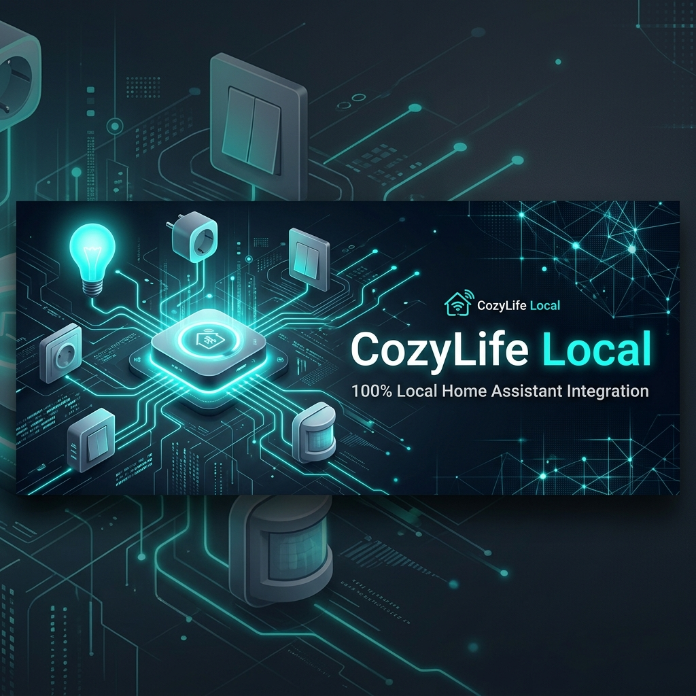

# CozyLife Local for Home Assistant

  
    
  <strong>A premium, 100% local Home Assistant integration for CozyLife smart devices. Control your switches, lights, smart plugs, and environment sensors securely without any cloud dependency.</strong> 
     
  
  
  

---

## ⚠️ Beta / Testing Phase

**This is a new integration and is currently in an active public testing phase.**

While it has been thoroughly verified and confirmed to work with multi-gang wall switches, dimmable lights, sensors, and power-metered outlets, physical device specifications vary by manufacturer and model layout (DPIDs). We are actively looking for testers to help expand the default catalog for CozyLife devices, including:

*   Single gang wall switches & smart plugs
*   High-power/power-monitoring smart plugs and outlets
*   RGB & Tunable White lights (bulbs, ceiling fixtures, and LED strips)
*   Battery-powered smart sensors (temperature, humidity, motion, door/window, smoke)

> [!NOTE]
> If you have an unsupported device model or experience issues, please follow our [Setup & Troubleshooting Guide](docs/SETUP_GUIDE.md#6-analyzing-discovery-logs--submitting-new-models) to extract and share your device's raw discovery logs.

---

## Key Features

*   ⚡ **100% Local Control**: Zero reliance on the CozyLife cloud. All control commands and sensor polling happen locally over your Wi-Fi network, ensuring maximum security, privacy, and ultra-low latency.
*   🔌 **Auto-Discovery Scanner**: Instantly scans your local IPv4 subnet (supports customizable CIDR, e.g. `192.168.1.0/24`) and displays the number of active CozyLife devices on the network.
*   📍 **Static IP & Sleep Sensor Modes**: Easily provision devices individually via single static IP addresses. Includes a specialized "Sleeping temp/humidity sensor" mode that leverages cached metadata to safely pre-build battery-powered entities before the hardware wakes.
*   🎛️ **Multi-Gang Switch Bitmasks**: Native, low-level bitmask control on DPID 1 ensures multi-gang rockers (e.g., double or triple rocker switches) act as individual, responsive entities.
*   📈 **Smart Energy Metering**: Auto-detects power-monitoring smart plug chips to expose voltage, current, active power, and cumulative energy sensors (compatible with the HA Energy Dashboard).
*   💡 **State & Color-Mode Safeguards**: Smooth transitions and automatic work-mode state preservation prevents smart lights from glitching or flashing dark blue during custom RGB commands.
*   🛠️ **Developer-Mode Setup**: Features a "Skip validation" config option, allowing advanced users to add remote devices or provision entities without waiting for active handshakes.

---

## Quick-Start Guide

For complete, detailed instructions on onboarding new hardware, configuring your router, and optimizing your network, read our [Comprehensive Device Setup Guide](docs/SETUP_GUIDE.md).

### Installation via HACS

1. **Add Custom Repository**:
   * Open **HACS** in Home Assistant ➔ Click **Integrations**.
   * Click the three dots in the top-right corner ➔ Select **Custom repositories**.
   * In the **Repository** field, paste: `https://github.com/soulripper13/cozylife_local`
   * Select **Integration** under the Category dropdown ➔ Click **Add**.

2. **Download Integration**:
   * Click on the newly discovered **CozyLife Local** integration card.
   * Click **Download** in the bottom-right corner and select the desired version.

3. **Restart Home Assistant**:
   * Navigate to `Settings` ➔ `System` ➔ Click `Restart` in the top right.

---

## Configuration

Once HACS has completed installation and Home Assistant has restarted:

1. Navigate to `Settings` ➔ `Devices & Services`.
2. Click `+ ADD INTEGRATION` in the bottom-right.
3. Search for **"CozyLife Local"** and click to open the configuration flow.
4. Set up your device:
   * **Auto-Scan**: Leave the IP field blank, review the CIDR, and hit submit to let the integration locate devices on your subnet.
   * **Manual Setup**: Input the static IP address of your device.
   * **Sleeping Environment Sensor**: If manual provisioning is for a battery-powered sensor, check the "Sleeping temp/humidity sensor" box to avoid handshake timeouts.
   * **Skip Validation**: Check this option to add remote or offline devices immediately (Developer Mode).

---

## CozyLife Data Point IDs (DPIDs)

CozyLife devices report their functionalities via standard Data Point IDs (DPIDs). Below is a quick-reference mapping of known features exposed by this integration:

| DPID | Target Function | Description |
|------|-----------------|-------------|
| `1` | Power / Switch Bitmask | Master light power, plug power, or multi-gang rocker state bitmask. |
| `2` | Work Mode / Countdown | Light profile settings on bulbs; gang-1 timer/countdown on switches. |
| `3` | Color Temperature | White light warmth control, scaled dynamically to custom Kelvin ranges. |
| `4` | Brightness / Humidity | Light intensity scaling, relative humidity levels on sensors, or gang-2 timers. |
| `5` | Hue | 360-degree color hue control on addressable RGB lights. |
| `6` | Saturation / Motion | Color saturation percentage, motion trigger status, or gang-3 timers. |
| `7` | Contact / Color Mode | Door/window magnetic contact sensor; secondary color spectrum mapping. |
| `8` | Temperature / Scene | Temperature sensor data (Celsius); pre-programmed lighting presets. |
| `9` | Battery Level | Exposes remaining battery charge on supported portable sensors. |
| `10` | Moisture Status | Water-leak detection and alarm sensor. |
| `11` | Smoke Detection | Smoke alarm status and alarm sensor. |
| `14` | Report Interval | Sleep interval timer for battery-operated sensors (default 1800s). |
| `24` | Humidity Sensitivity | Delta threshold to trigger updates on environmental sensor arrays. |
| `25` | Temp Sensitivity | Delta threshold to trigger updates on environmental sensor arrays. |
| `26` | Cumulative Energy (kWh)| Exposes total energy consumption, fully compatible with HA Energy Dashboard. |
| `27` | Active Current (mA) | Live electrical current monitoring. |
| `28` | Active Power (W) | Live active load power monitoring. |
| `29` | Line Voltage (V) | Live grid voltage monitoring. |
| `30` | Electrical Fault | Exposes physical load fault alarms reported by power monitoring plugs. |
| `101`| Occupancy Sensor | Proximity and movement detection via millimeter-wave radar modules. |

---

## Troubleshooting & FAQ

Please refer to the [Troubleshooting & Network Tuning Section in our Setup Guide](docs/SETUP_GUIDE.md#5-network-troubleshooting--router-tuning) if you encounter:
*   Devices repeatedly dropping offline or showing as `Unavailable`
*   Network firewall questions or router Access Point (AP) isolation settings
*   Multicast auto-discovery failures or IGMP Snooping advice
*   Missing electricity metering or power monitoring entities

---

## Contributing

We welcome community contributions, particularly new CozyLife model catalog additions! 

1. Fork the repository and create a feature branch.
2. If adding a new device PID, update `model.json` to register the new mapping.
3. Test your changes locally.
4. Open a Pull Request detailing the device hardware, PID, and DPIDs.

Please include active debug logs (showing the `Successfully discovered device` handshake details) when opening issues or pull requests.

---

## Support the Project

This project is developed and maintained in spare time and is provided free to the community. Any contribution is appreciated — but never required ❤️

### Ways to Support

*   **Ko-fi**: [https://ko-fi.com/soulripper13](https://ko-fi.com/soulripper13)
*   **PayPal**: [https://paypal.me/SKatoaroo](https://paypal.me/SKatoaroo)
*   **Bitcoin (BTC)**: `bc1qvu8a9gdy3dcxa94jge7d3rd7claapsydjsjxn0`
*   **Solana (SOL)**: `4jvCR2YFQLqguoyz9qAMPzVbaEcDsG5nzRHFG8SeaeBK`

Thank you for being part of the CozyLife Local community!
